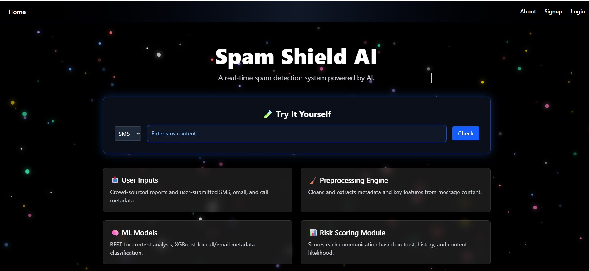

# 🛡️ Spam Shield AI

**Spam Shield AI** is an AI-powered solution designed to detect and prevent spam across multiple communication channels — including **calls**, **SMS**, and **emails** — with multilingual support (including Hinglish). The system analyzes user-submitted content, applies advanced transformer models, and computes a real-time **risk score** to help identify and manage potential fraud.

---

## 🌟 Key Features

### 📩 SMS & Email Spam Detection
- Uses **BERT-based transformer models** trained on real-world datasets.
- Supports multilingual inputs including **English and Hinglish**.
- Analyzes message content, sender information, and intent to flag spam.

### 📞 Call Risk Analysis
- Detects suspicious call patterns using metadata like:
  - Call type (VOIP/fixed/mobile)
  - Contact status (saved/unknown)
  - Frequency of interaction
- Generates a **risk score** using weighted logic (line score + carrier score).

### 📊 Risk Score Computation
- Combines AI prediction with trust signals to produce a confidence score.
- Enables users to understand how likely a communication is to be spam.

### 🌐 Crowd-Sourced Spam Reporting
- Allows users to report suspicious messages, emails, or calls.
- Helps build a smarter, community-driven dataset for continuous model improvement.

### 📱 Real-Time User Interaction
- Clean, intuitive **React.js frontend** for user inputs and feedback.
- Backend built with **FastAPI** to handle fast, scalable AI model integration.

---

## 🧠 How It Works

1. **User inputs** a call log, SMS, or email.
2. The data is passed to the backend where:
   - SMS/Email text is processed by a fine-tuned **BERT model**.
   - Call metadata is evaluated for risk using predefined logic.
3. The backend calculates a **Risk Score** by fusing model predictions and contextual signals.
4. The score is displayed to the user to flag potential spam or fraud.
5. Users can also submit new spam content to the system for further learning.

---

## 🧰 Tech Stack

- **Frontend**: React.js, Tailwind CSS
- **Backend**: FastAPI (Python)
- **AI/NLP Models**: BERT (for SMS, Email,Call), used open-ai whisper library for audio(call recording file) to text conversion
- **External Integration**: Model APIs for classification, user feedback submission
- **Languages**: Python, JavaScript
- **Database**: MongoDB

---

## 🎯 Use Cases

- Mobile applications for spam call and SMS detection
- Email clients with real-time filtering
- Telecom dashboards for fraud monitoring
- Public portals for crowdsourced spam/fraud reports

---

## 🤖 AI-Driven. Privacy-Focused. Community-Powered.

Spam Shield AI brings together modern AI, simple UX, and public collaboration to fight the everyday battle against digital spam and fraud.

